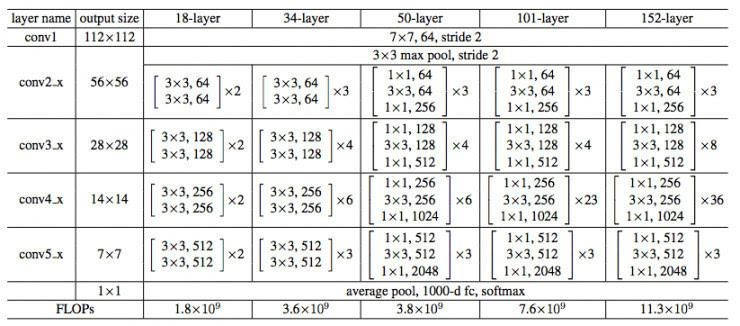

# 10-Class-Resnet-Pytorch
Written by Haolin Zhang 
T_Resnet for transportation object classification 
Update date:2019/10/28

## Environment

pytorch 1.2
pytorch-gpu 1.2
opencv 3+
torchnet
numpy
python2.7+
torchvision
visdom

- install torchnet in conda :https://blog.csdn.net/weixin_43264516/article/details/83187775 
- please rebuild it in python2.7!

ResNet Pretrained Model Download:
	ResNet34----BasicBlock    /    ResNet101----Bottleneck----shortcut connection

## Run in (for reference)

Intel i7-6700K
NVIDIA 2070 Super

### Tools

folder TOOLS 
checkimage.py ----->check if all the images are in 'RGB' shape.
txtdata.py  -------> write the class with image names into TXT.

please copy this .py into the data/images/train(val)
 

### Notes

dataset.py 62line --->   if using JPG RGB ---->  data = Image.open(img_path).convert('RGB')
if cannot load the keyvalue -----> Reading -----> https://blog.csdn.net/yangwangnndd/article/details/100207686

### Goal

train our own dataset in RESNET  (for pedestrian detection project)

### Dataset 

partly obtained from 
- From Caltech 101 (http://www.vision.caltech.edu/Image_Datasets/Caltech101/)
- From Caltech 256  (http://www.vision.caltech.edu/Image_Datasets/Caltech256/)
- From Cars Dataset (https://ai.stanford.edu/~jkrause/cars/car_dataset.html)
- From INRIA Person Dataset (http://pascal.inrialpes.fr/data/human/)

mainly obtained from

- From PEdesTrian Attribute (PETA) Dataset (http://mmlab.ie.cuhk.edu.hk/projects/PETA.html)
//// Deng, Yubin, et al. Pedestrian attribute recognition at far distance. Proceedings of the 22nd ACM international conference on Multimedia. ACM, 2014. ////
- From MIO-TCD dataset (http://podoce.dinf.usherbrooke.ca/challenge/dataset/)
//// Z. Luo, F.B.Charron, C.Lemaire, J.Konrad, S.Li, A.Mishra, A. Achkar, J. Eichel, P-M Jodoin MIO-TCD: A new benchmark dataset for vehicle classification and localization in press at IEEE Transactions on Image Processing, 2018 ////

### Object Classes

0---pedestrian 
1---car
2---bus
3---non-motorized vehicle
4---motorcycle
5---bicycle
6---truck
7---work van
8---animal
9---background

### Using Steps

Pytorch_ResNet34(or ResNet101)

- dataset：
  - train：`./data/`
  - model：`./models/` (https://cloud.tsinghua.edu.cn/d/dbf0243babd443c49e21/)
- train：
  - use`nohup python -m visdom.server &`open`Visdom`net
    or  #important!#  'python -m visdom.server'
  - run`classifier_train.py`
  - save`.pth` in `./models/`
  - note：modify the parameters in `batch_size`
    - ResNet34，1GPU，`batch_size=120`，<7G  Recommend:20
    - ResNet101，1GPU，`batch_size=60`，<10G Recommend:unkown

- test stp：
  - revise `classifier_test.py`，`ckpt`---path of trained model，`testdata_dir`----path of test images
    note:`ckpt`should be paired with `model`
  - run `classifier_test.py` get results

### Test code

1. Test parameters
2. models ResNet34 or ResNet101
3. tester  using Tester
   `_load_ckpt()`   model load
   `test()` project one image

### Result

- Loss

- accuracy

### Reference

- [pytorch](https://github.com/pytorch/pytorch)
- [pytorch-book](https://github.com/chenyuntc/pytorch-book)

